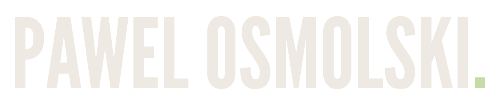

# Pawel Osmolski Portfolio



A server-rendered PHP portfolio covering music, web development, software and sound design. The modern site is one main page with a separate Radiohead remixes landing page, alongside working versions of two earlier designs.

No framework, database, Composer dependencies, package installation or build step is required.

## Structure

- `public/` — web server document root, page entry points and browser assets.
- `src/` — PHP helpers, shared templates, project data and preserved-page templates; keep outside the document root.
- `tests/` — rendering, routing and asset checks.
- `backup/legacy/` — historical source and assets, retained for reference. Do not serve this directory; the working preserved pages use copies in `public/` and `src/`.
- `media/` — retained reference material; outside the document root.

## Pages

| URL | Purpose |
| --- | --- |
| `/` | Modern portfolio: About, Music, Web, Software, Sound, Remix and Contact |
| `/radiohead-remixes/` | Modern Radiohead remixes landing page |
| `/retro.php` | Original fixed-width music portfolio |
| `/legacy.php` | Preserved pre-refresh one-page portfolio |
| `/radiohead-remixes/legacy.php` | Companion legacy Radiohead page |

## Run locally

From the repository root, use PHP 8.3 or later:

```sh
php -S 127.0.0.1:8123 -t public
```

Open <http://127.0.0.1:8123/>. The PHP development server is for local preview only.

Run the checks in another terminal:

```sh
php tests/smoke.php
php tests/retro.php
php tests/legacy.php
php tests/legacy-radiohead.php
```

These check rendering, local assets and relevant routes, metadata and anchors. They do not verify third-party playback or establish full accessibility compliance.

## Editing

| Content | File or directory |
| --- | --- |
| Homepage copy and contact icons | `public/index.php` |
| Modern remix page | `public/radiohead-remixes/index.php` |
| Web project details and optional destination URLs | `src/projects.php` |
| Software project details and URLs | `src/software-projects.php` |
| Shared modern layout and helpers | `src/header.php`, `src/footer.php`, `src/bootstrap.php` |
| Modern styles, interactions and images | `public/assets/site.css`, `public/assets/site.js`, `public/assets/images/` |
| Original portfolio | `public/retro.php`, `src/retro/`, `public/assets/retro/` |
| Legacy portfolio and remix templates | `src/legacy/` |
| Legacy styles, scripts and artwork | `public/assets/legacy/` |

The Software section contains AMPBoard, DarkOneJSP3, ReShade Effect Shader Toggler Enhanced and ERModsMerger. These entries are maintained locally, not automatically synchronised with the GitHub profile README.

Web projects with a `url` have linked titles and linked image-preview captions. Café Crêpe has no destination URL and retains plain text. Project title and preview-caption links have no underline.

On the modern pages, SoundCloud and YouTube embeds load only after a visitor chooses to load them. Direct media links remain available without JavaScript and after loading. Image links work without JavaScript; native dialogs add previews, Escape-to-close and focus restoration. Fonts and artwork are served locally.

## Preserved portfolios

Two small SVG icons in the contact section lead to earlier designs:

- The egg links to `/retro.php` and cracks open on hover or keyboard focus.
- The Crann Bethadh (Celtic tree of life) links to `/legacy.php` and highlights on hover or keyboard focus.

Both links use `rel="nofollow"` and have accessible labels. They are separate from the main navigation.

The original portfolio retains its bitmap artwork, fixed-width layout and historical biography. PHP routes use a fixed allowlist; invalid or array inputs return 404. Native scrolling and media dialogs replace the old scrollbar, Highslide and Flash. A return link leads to the modern portfolio.

The legacy portfolio retains its original copy, portrait, typography and galleries. Galleries advance automatically with previous, next and pause controls; reduced-motion preferences start them paused. Its back-to-top banner fades in and out, and its contact footer slides up and down, using 0.2-second transitions. The chevron is an inline SVG, requiring no icon font. Reduced-motion preferences disable transitions.

Legacy media players use lazy HTTPS embeds. The legacy Radiohead page preserves its background, artwork and historical credits; a direct profile link replaces the retired Twitter widget. The legacy portfolio links to this companion page, whose return link leads back to `/legacy.php`. The legacy portfolio footer links to the modern site. Active preserved pages no longer depend on jQuery, Highslide, Flash or Universal Analytics.

## Search visibility

Only the two modern URLs appear in `public/sitemap.xml`. The preserved pages have `noindex` meta directives; the original retro page additionally uses `nofollow`.

`public/robots.txt` permits crawling so search engines can read those directives. The contact icons' `nofollow` attributes discourage following the links; they are not access controls or guaranteed crawl blocks. All preserved pages remain public.

## Review notes

Historical biographies, project examples and Radiohead credits are preserved as historical material. Third-party links, embeds and playlist contents can change independently of this repository.

The modern site includes keyboard focus styles, a skip link, image descriptions and reduced-motion support. Screen-reader, browser zoom and embedded-media accessibility checks remain useful; the preserved designs need separate assessment, especially the fixed-width retro page.

**Licence:** © 2026 Pawel Osmolski. All rights reserved. Source provided for portfolio and evaluation purposes.
